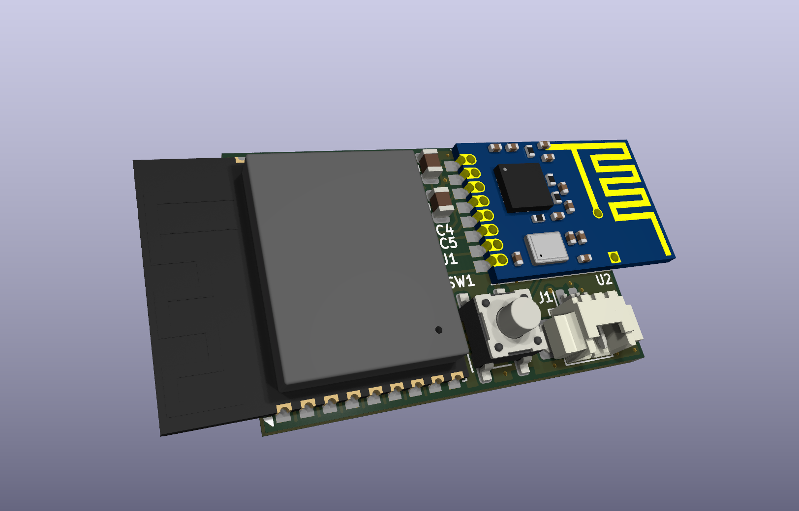

# MiLight Hub base PCB

Compact ESP32-C3 and nRF24L01+ based hardware for running a MiLight hub.

## Overview

This repository contains a KiCad hardware design for a small standalone MiLight bridge board.

The design is built around:

- `ESP32-C3-WROOM-02`
- an `nRF24L01+` compatible radio module (castellated SMD version)
- an on-board buck regulator for `3.3 V`
- a Molex PicoBlade power input (because it's tiny and I had it in stock)
- a pogo-pad programming header for external flashing

The goal is a compact dedicated board for MiLight integration rather than a generic development board or Home Assistant add-on.

## Firmware

This hardware is intended to run the excellent MiLight hub firmware from:

- https://github.com/sidoh/esp8266_milight_hub

That project provides the MiLight protocol handling and integrations. This repository focuses on the PCB and schematic needed to host compatible firmware on dedicated hardware.

## Repository Contents

- `milight-hub-base.kicad_pro`: KiCad project
- `milight-hub-base.kicad_sch`: schematic
- `milight-hub-base.kicad_pcb`: PCB layout
- `milight-hub-base.kicad_dru`: board design rules
- `fp-lib-table`: project footprint library table
- `lib/`: local project footprints and 3D assets

## Tooling

- KiCad project files are stored in this repository
- local footprint data is included in `lib/`
- generated local review artifacts are intentionally not tracked

## License

The hardware design files in this repository are licensed under the CERN Open Hardware Licence Version 2 - Strongly Reciprocal (`CERN-OHL-S-2.0`). See [`LICENSE`](LICENSE).
